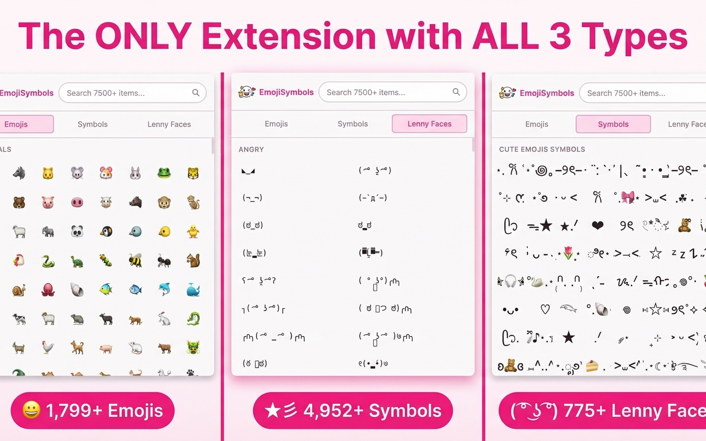
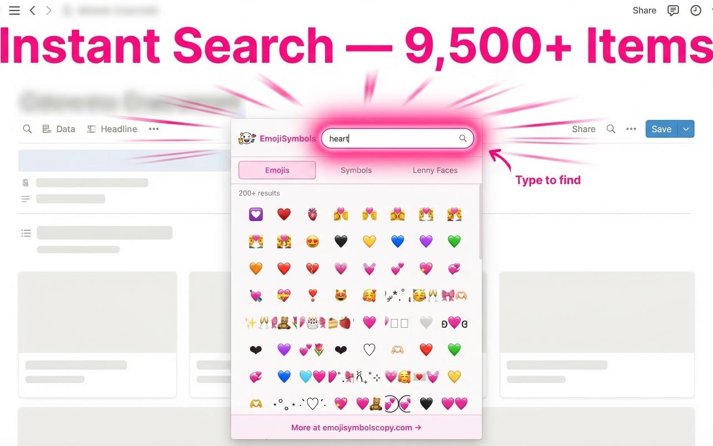
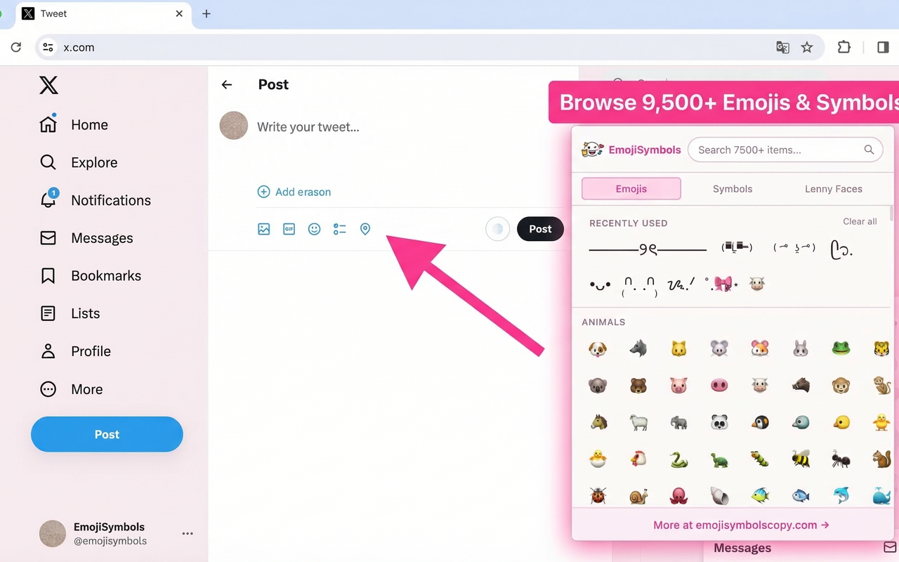

# Emoji & Symbols Copy and Paste + Lenny Face — Browser Extension

A free, lightweight Chrome extension to copy and paste 9,500+ emojis, special symbols, Unicode characters, and lenny faces ( ͡° ͜ʖ ͡°) with a single click. Browse 94 categories, search instantly, or pick from your recently used items. Works 100% offline on Chrome, Edge, and Firefox. Built by [emojisymbolscopy.com](https://emojisymbolscopy.com).

[](LICENSE)



---

## Features

- **9,500+ items** — 1,799 emojis · 4,952 Unicode symbols · 775 lenny faces & kaomoji
- **Instant search** — type any keyword to filter across all categories in milliseconds
- **One-click copy** — click any emoji, symbol, or lenny face to copy to clipboard instantly
- **94 categories** — organized across 3 tabs (Emojis · Symbols · Lenny Faces)
- **Recently used** — remembers your last 50 copied items for quick access
- **Keyboard navigation** — arrow keys to browse, Enter to copy, Escape to close
- **100% offline** — zero network requests, no external dependencies, no tracking
- **Ultra-lightweight** — under 500 KB total (competitors are 54 MB!)
- **Cross-browser** — Chrome · Edge · Firefox

---

## Why This Extension?

Most emoji tools only cover standard emoji. This is the **only** browser extension that combines all three types — emojis, Unicode symbols (arrows ← → ↑ ↓, math ∑ ∫ √, decorative ★ ☆ ♠ ♣), and lenny faces (╯°□°)╯︵ ┻━┻ — in one searchable popup.

|  | This Extension | Typical Emoji Extensions |
|--|----------------|--------------------------|
| Emojis | ✅ 1,799 | ✅ ~1,500 |
| Unicode Symbols | ✅ 4,952 | ❌ Not included |
| Lenny Faces | ✅ 775 | ❌ Not included |
| Total Size | < 500 KB | 12–54 MB |
| Works Offline | ✅ Yes | ❌ Often requires server |
| Data Collection | ✅ Zero | ⚠️ Varies |



---

## Install

### Chrome

[Install from Chrome Web Store](https://chromewebstore.google.com/detail/emoji-symbols-copy-and-pa/epaddnflmjokjddnghjfhlkndieilkmb)

### Edge

[Install from Edge Add-ons](https://microsoftedge.microsoft.com/addons/detail/noefkldhlfnlakjomdmfdmkcmhipnppc)

### Firefox

[Install from Firefox Add-ons](https://addons.mozilla.org/en-US/firefox/addon/emoji-symbols-copy-and-paste/)

### Load Unpacked (Development)

1. Clone this repository:
   ```bash
   git clone https://github.com/ChipenYip/emoji-symbols-copy-paste.git
   ```
2. Open Chrome → `chrome://extensions/`
3. Enable **Developer mode** (top right toggle)
4. Click **Load unpacked** → select the `chrome-extension/` folder
5. Pin the extension to your toolbar — done!

> The repository includes all data files. No build step required.

---

## Keyboard Shortcuts

| Shortcut | Action |
|----------|--------|
| `Alt+Shift+E` | Open the extension popup |
| `↑` `↓` `←` `→` | Navigate between items |
| `Enter` | Copy selected item to clipboard |
| `Tab` | Switch between Emojis / Symbols / Lenny Faces tabs |
| `Escape` | Close the popup |

---

## Privacy

EmojiSymbols runs **100% locally** on your device:

- **Zero data collection** — no analytics, no tracking, no telemetry
- **Zero network requests** — works completely offline
- **Zero permissions abuse** — only uses `storage` (for Recently Used items)
- Your clipboard content never leaves your browser

Read the full [Privacy Policy](https://emojisymbolscopy.com/privacy-policy#chrome-extension).

---

## Data Sources

All emoji, symbol, and lenny face data originates from [emojisymbolscopy.com](https://emojisymbolscopy.com):

| Source | Items | Description |
|--------|-------|-------------|
| Emojis | 1,799 | Standard Unicode emoji (Emoji 15.1) |
| Symbols | 4,952 | Arrows, math, currency, decorative, technical Unicode characters |
| Lenny Faces | 775 | ASCII art faces, kaomoji, and text emoticons |



---

## Contributing

Contributions are welcome! Please read the [Contributing Guide](CONTRIBUTING.md) before submitting a PR.

Quick rules:
- Keep `popup.js` under 700 lines
- No inline scripts or styles (CSP compliance required)
- Use `browser.*` namespace (polyfill handles Chrome/Edge/Firefox)
- Test in Chrome and Firefox before submitting

---

## License

MIT © [emojisymbolscopy.com](https://emojisymbolscopy.com)

---

**More emojis, symbols, and lenny faces at [emojisymbolscopy.com](https://emojisymbolscopy.com)** — the full web version with even more content, no extension needed.
